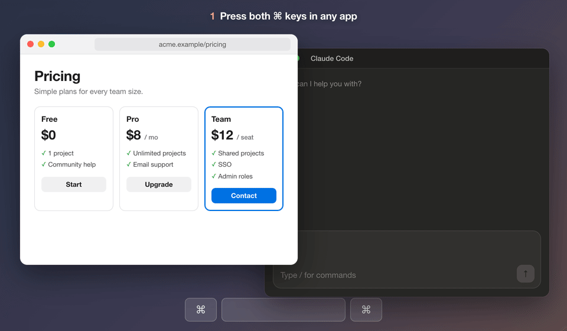

# Appshot for Claude

Press both ⌘ keys in any Mac app. Claude Code gets a screenshot of that window and its text, ready to go with your next message.

It works like the Appshots feature in OpenAI's Codex app, as a Claude Code plugin. This is a community plugin, not made by Anthropic.



## What you get

- The window's screenshot, pasted into the prompt box of the Claude desktop app as a normal image attachment.
- The window's text, read through macOS accessibility, including parts scrolled out of view. Web pages in Safari, Chrome and Electron apps come through as readable text with links.
- A bar above the prompt box that lists each capture, with **Show text** and **Remove**.

You can capture several windows before sending. They all go with your next message, and the bar clears once it's sent.

## Requirements

- macOS
- Claude Code 2.1.288 or newer, in the desktop app or a terminal
- Xcode Command Line Tools (`xcode-select --install`). The helper is compiled once, on first use.

## Install

In Claude Code:

```
/plugin marketplace add parhamfa/appshot-for-claude
/plugin install appshot-for-claude@appshot-for-claude
```

Then start a new session. The first time it runs, macOS asks you to give Claude two permissions in System Settings → Privacy & Security:

- **Accessibility**, for the hotkey and the window text
- **Screen Recording**, for the screenshot. Restart Claude after granting it.

## Use

1. Go to the window you want and press both ⌘ keys together.
2. Claude comes to the front with the screenshot in the prompt box and the capture listed above it.
3. Type your question and send.

With several sessions open, captures go to the one you last sent a message from. Run `/appshot` in a session to send captures there and to check the helper's status.

In the desktop app, a conversation that hasn't sent its first message yet has no Claude Code process. A capture made while you look at it shows up in the bar of the session you last used. The screenshot still lands in the prompt box in front of you. When you send that conversation's first message with the screenshot in it, within 30 minutes of the capture, the text comes along, and the other session's bar drops it. After that the text stays with the other session.

## What Claude receives

Each capture is attached to your message like this:

```
<appshot app="Safari" window="Pricing - Example" url="https://example.com/pricing">
Screenshot: ~/.claude/appshots/captures/…/window.png
Window text:
Window: "Pricing - Example", App: Safari.
standard window Pricing - Example
	split group
		…
			HTML content …, Value: **Plans** [Pro](example.com/pro) …
The focused UI element is text field Search
</appshot>
```

The text follows the same format as Codex: the window's accessibility tree, one element per line, with a web page as one block of text. Text over 90,000 characters is cut, and the full version stays on disk.

Apps that draw their own interface, like Telegram or games, expose almost no text. For those you get the window title and the screenshot.

## How it works

- `helper/appshot-helper.swift` is a small background program. It listens for both ⌘ keys, captures the front window with `screencapture`, reads its accessibility tree, and pastes the screenshot into Claude.
- `hooks/register.tsx` is the plugin. It starts the helper, picks up captures, draws the bar, and attaches the text when you send.

One helper runs per Mac. It is compiled to `~/.claude/appshots/bin/` on first use. Captures are saved in `~/.claude/appshots/captures/` and deleted after 7 days. Nothing leaves your Mac except what you send to Claude.

## Limits

- macOS only.
- In a terminal session the screenshot isn't pasted. Claude opens it from disk instead.
- Pressing ⌘⌘ while Claude is in front captures the app you used before it, but only if that window is visible. With Stage Manager on, it usually isn't.
- The plugin uses Claude Code's plugin hooks API, which is in early access and may change between releases.

## Uninstall

```
/plugin uninstall appshot-for-claude@appshot-for-claude
```

To also remove the helper and saved captures, delete `~/.claude/appshots`.

## License

MIT
